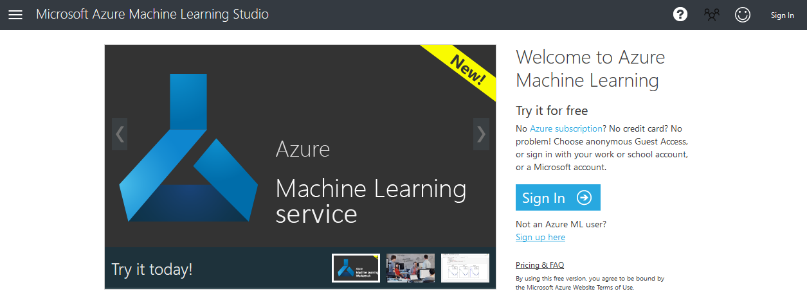
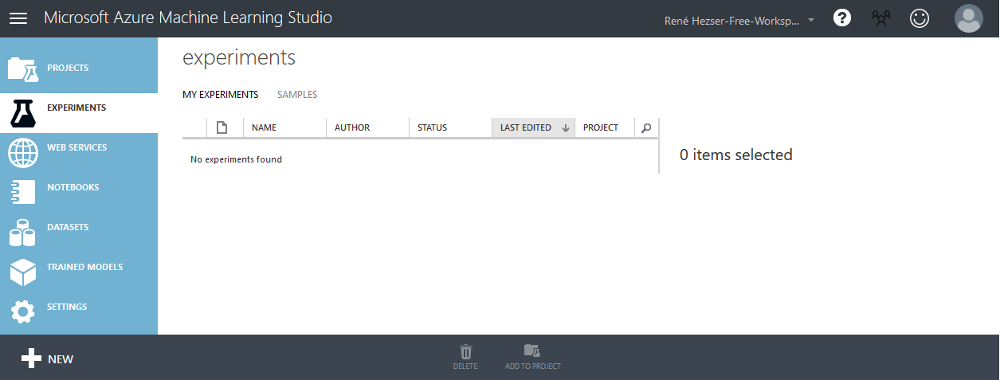
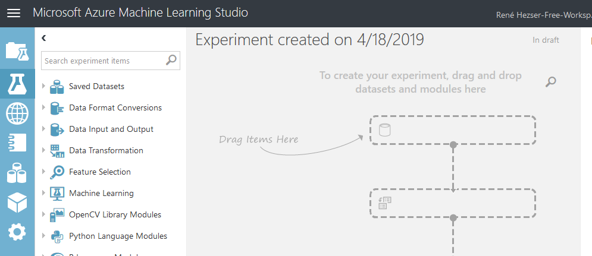
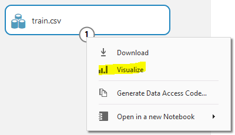
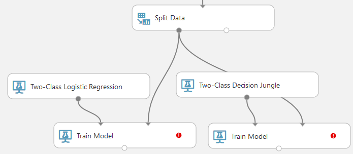
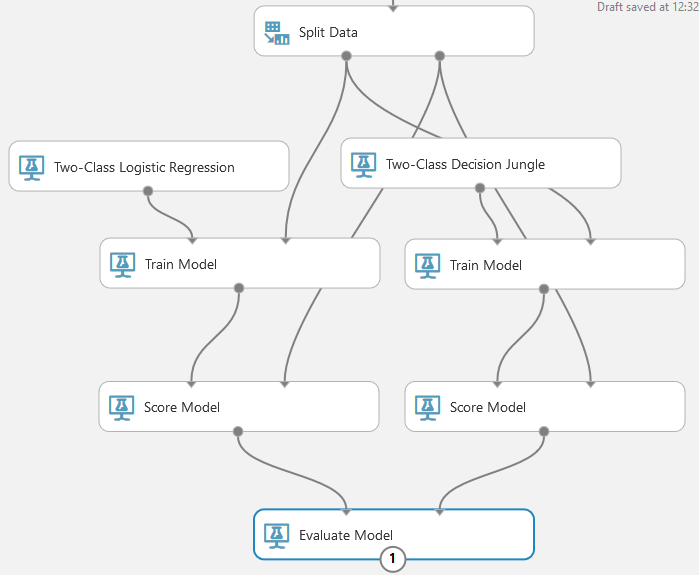
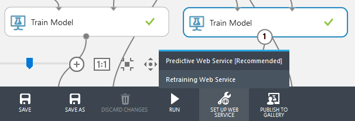
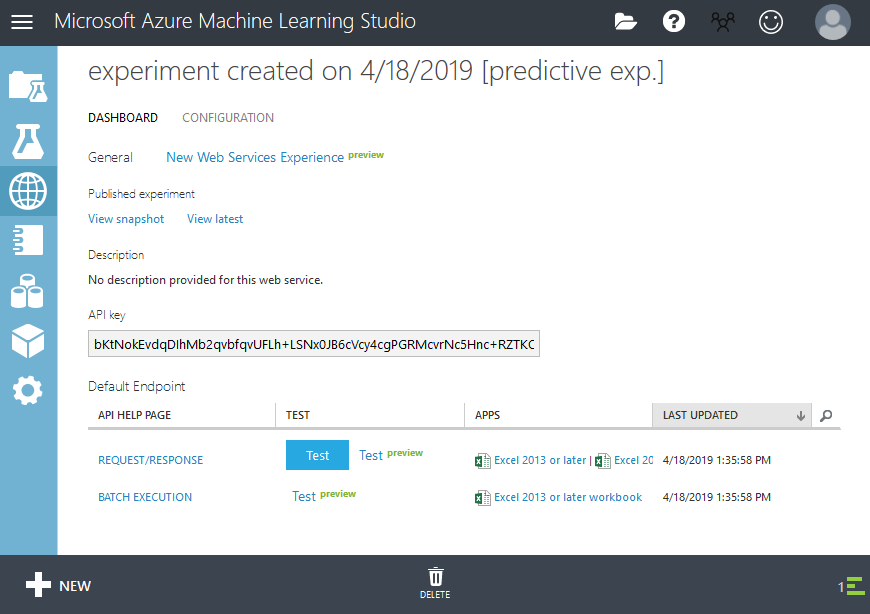

# Hands-On
We will use Machine Learning Studio and available data to determine if you would have survived the Titanic catastrophe.
## Create an experiment in Machine Learning Studio
Open [https://studio.azureml.net/](https://studio.azureml.net) and sign in (or up if you have not previously).

After signing in, you will see the workspace and might be greated with an offer to take a tour of Azure ML.

## Add test data
Data for training and testing the model can be downloaded from [kaggle](https://www.kaggle.com/c/titanic/overview). If you do not want to register on that site, you can download the two files directly from [GitHub](https://github.com/pcsanwald/kaggle-titanic)1. *test.csv* and *train.csv* will be used to train the model and later test it to validate the machine learning algorithm.

Click on **+New** and create a new dataset from a local file (*train.csv*).

## Create an experiment
* Create a new blank experiment.

* Add the uploaded data from *Saved Datasets/My Datasets* to the experiment. You will see that the workspace changes and the placeholder graphic is replaces with one bubble and you dataset.

* Get a quick insight on how the data looks like by clicking on the connection of the step. You can click on headers to see some statistics of that particular column.

    

In machine learning the input is called a **feature** whereas the output (what we want to predict) would be a **label**.

Categorical data are columns that are not treated as their actual data type. A zip code is an example, as it is part of the adress and you will most likely - even if it is a number - not want to calculate with it.

## Prepare the data
Cleaning the data before passing it to the machine learning algorithm will enable us to use it for machine learning at all. Drag the needed action bubbles from the left to the workspace. You can search or find them directly.

Oh, and don't forget to connect the bubbles and take your time to see all options of the dialogs :wink:

* Use "Select Columns in Dataset" to remove *name*, *sibsp*, *parch*, *ticket*, *cabin*, *embarked*
* Use "Edit Metadata" and change the columns *survived*, *pclass*, *sex* to **Make categorical**, as we do not intend to calculate with them
* Use "Edit Metadata" and change the column *survived* to be a **Label**

Now the data cleaning process is done and you can Save and Run the model with the buttons at the bottom of the window. After that, use the "Visualize" feature to see the result of the last "Edit Metadata" step.

## Model the machine learning model
Drag the "Split Data" action and set the "Fraction of rows in the first output dataset" value to 0.7 to have 70% of the data being passed to the first output and 30% to the second.

### Split and train
Now add two models, two "Train Model" actions and connect them. 

Configure the "Train Model" associated to the models to include the column *survived*, as this is what we want to predict.

### Score models
Create two "Score Model" actions and configure their inputs to one model each and the held back training data (the free second output of the "Split Data" action).

### Evaluate model
Add "Evaluate Model" and connect it to the previously added "Score Model" actions.

Now "Save" and "Run" again and look at the output of the last step to see how the models behave2.

## Deploy the model
From the two models select the one that performed better and deploy a "Predictive Web Service".

This creates a testing experiment and setup a webservice with a REST endpoint to interact with it.

Now you can actually deploy the webservice with the "Deploy Web Service" button at the bottom of the workspace. Ups. Yeah. Hit "Run" first and then "Deploy Web Service".

You can test the deployed service by clicking on the blue **Test** button.

| Field  | Value  |
|---|---|
| survived |   |
| pclass  | 1 |
| name  | Rose |
| sex | female |
| age| 20 |
| sibsp | 0 |
| parch | 1 |
| ticket | something |
| fare | 200 |
| cabin | A23 |
| embarked | S |
The test result will be available at the bottom.

# Reference
## kaggle
* [Titanic: Machine Learning from Disaster](https://www.kaggle.com/c/titanic)
## Channel 9
* [Using Azure Machine Learning to Predict Who Will Survive the Titanic - Part 1](https://channel9.msdn.com/Blogs/raw-tech/Using-Azure-Machine-Learning-to-Predict-Who-Will-Survive-the-Titanic-Part-1)
* [Using Azure Machine Learning to Predict Who Will Survive the Titanic - Part 2](https://channel9.msdn.com/Blogs/raw-tech/Using-Azure-Machine-Learning-to-Predict-Who-Will-Survive-the-Titanic-Part-2)
## Misc
* [Microsoft Azure Machine Learning Cheat Sheet](aka.ms/AzureMachineLearningCheatSheet)

## Footnotes
1. Make sure you downloaded the csv files and not the HTML file that shows the csvs. Click on the files, then switch to RAW and download the page as *.csv]

2. Scroll down while looking at the "Visualize" page. There is more then just a graph
